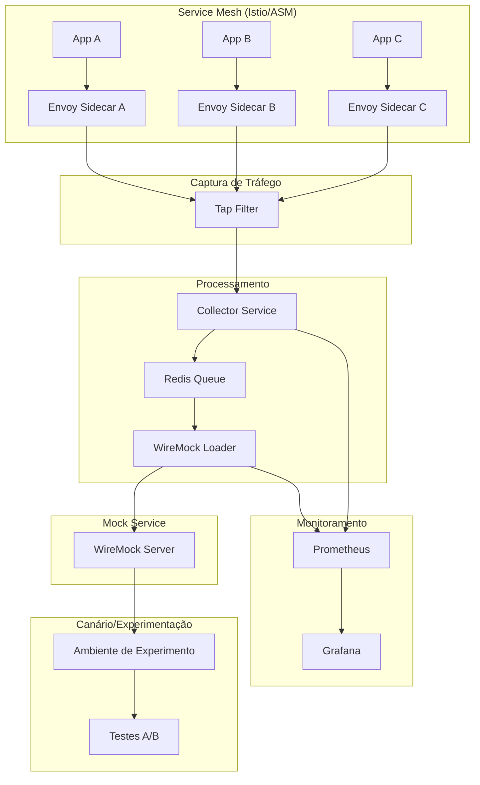
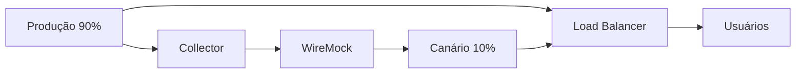
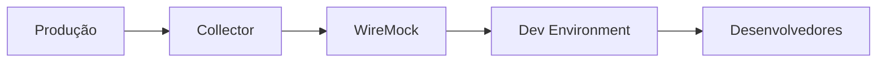
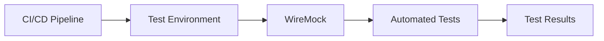
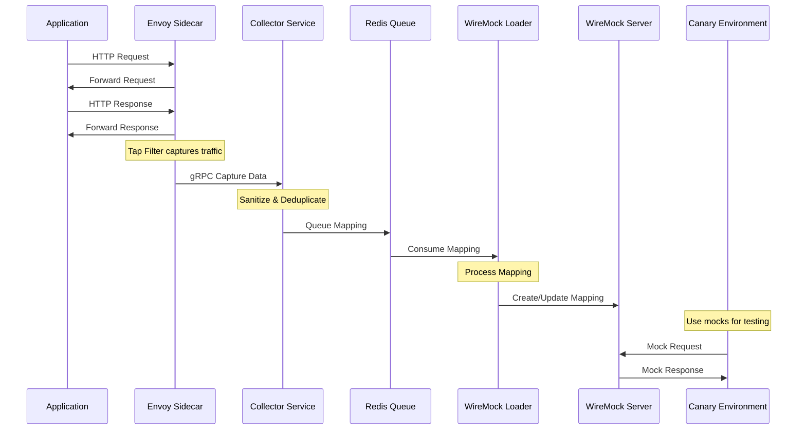

# Arquitetura - Backend Mockado Automático

## 🏗️ Visão Geral da Arquitetura

O Backend Mockado Automático é um sistema distribuído que captura automaticamente tráfego HTTP em ambientes de service mesh, sanitiza dados sensíveis, deduplica requests e gera mocks automaticamente para ambientes de canário e experimentação.



## 🔧 Componentes Principais

### 1. Envoy Tap Filter
**Responsabilidade**: Captura transparente de tráfego HTTP/gRPC

**Características**:
- Intercepta requests/responses sem modificar aplicações
- Configurável por namespace ou globalmente
- Sampling opcional para reduzir overhead
- Filtros por host/endpoint
- Limite de body configurável (4KB-8KB)

**Configuração**:
```yaml
apiVersion: networking.istio.io/v1alpha3
kind: EnvoyFilter
metadata:
  name: tap-filter
spec:
  configPatches:
  - applyTo: HTTP_FILTER
    match:
      context: SIDECAR_INBOUND
      listener:
        filterChain:
          filter:
            name: "envoy.filters.network.http_connection_manager"
    patch:
      operation: INSERT_BEFORE
      value:
        name: envoy.filters.http.tap
        typed_config:
          "@type": type.googleapis.com/envoy.extensions.filters.http.tap.v3.Tap
          common_config:
            static_config:
              record_headers_received_trailers: true
              record_downstream_connection: true
```

### 2. Collector Service
**Responsabilidade**: Processamento assíncrono de capturas

**Características**:
- Recebe dados via gRPC do Envoy
- Sanitiza dados sensíveis automaticamente
- Deduplica requests por hash (método + path + query + body)
- Envia para fila Redis de forma assíncrona
- Métricas Prometheus integradas

**Tecnologias**:
- **Runtime**: Python 3.11+ com FastAPI
- **gRPC**: Para receber dados do Envoy
- **Redis**: Fila assíncrona para WireMock Loader
- **Prometheus**: Métricas de performance e saúde

**Fluxo de Processamento**:
```python
# 1. Receber captura via gRPC
capture = await grpc_service.receive_capture()

# 2. Sanitizar dados sensíveis
sanitized_request = sanitizer.sanitize_request(capture.request)
sanitized_response = sanitizer.sanitize_response(capture.response)

# 3. Verificar duplicação
if not deduplicator.is_duplicate(sanitized_request):
    # 4. Gerar mapping WireMock
    mapping = generate_wiremock_mapping(sanitized_request, sanitized_response)
    
    # 5. Enviar para fila Redis
    await redis_client.lpush("wiremock_mappings", json.dumps(mapping))
```

### 3. WireMock Loader Service
**Responsabilidade**: Carregamento de mappings no WireMock

**Características**:
- Consome fila Redis de forma assíncrona
- Carrega mappings no WireMock via API REST
- Backup automático de mappings
- Retry com backoff exponencial
- Health checks e métricas

**Tecnologias**:
- **Runtime**: Python 3.11+ com FastAPI
- **Redis**: Consumo da fila de mappings
- **HTTP Client**: httpx para comunicação com WireMock
- **Backup**: Armazenamento local/S3 opcional

### 4. WireMock Server
**Responsabilidade**: Servir mocks HTTP para experimentos

**Características**:
- Servidor de mocks HTTP/JSON
- API administrativa para gerenciar mappings
- Suporte a templates e transformações
- Logs de requests para debugging
- Interface web para visualização

## 🔒 Sanitização de Dados

### Padrões Detectados e Sanitizados

| Tipo | Padrão | Substituição |
|------|--------|--------------|
| JWT Tokens | `Bearer eyJ...` | `SANITIZED_JWT` |
| API Keys | Headers com `key`, `token`, `secret` | `SANITIZED_HEADER` |
| Senhas | Campos `password`, `passwd`, `pwd` | `SANITIZED_PASSWORD` |
| Cartões | Números 13-19 dígitos | `SANITIZED_CARD` |
| CPF | `XXX.XXX.XXX-XX` | `SANITIZED_DOCUMENT` |
| CNPJ | `XX.XXX.XXX/XXXX-XX` | `SANITIZED_DOCUMENT` |
| Telefones | `+XX XX XXXXX-XXXX` | `SANITIZED_PHONE` |
| Emails | `user@domain.com` | `SANITIZED_EMAIL` |
| Cookies | Headers `Cookie`, `Set-Cookie` | `SANITIZED_HEADER` |

### Algoritmo de Sanitização

```python
def sanitize_data(data):
    if isinstance(data, dict):
        return {k: sanitize_data(v) for k, v in data.items()}
    elif isinstance(data, list):
        return [sanitize_data(item) for item in data]
    elif isinstance(data, str):
        # Aplicar regex patterns para detectar dados sensíveis
        for pattern, replacement in SENSITIVE_PATTERNS:
            data = re.sub(pattern, replacement, data)
        return data
    else:
        return data
```

## 🔄 Deduplicação de Requests

### Algoritmo de Hash
```python
def generate_hash(request):
    # Normalizar dados para hash consistente
    normalized = {
        "method": request.method.upper(),
        "path": request.path,
        "query": sorted(request.query.items()) if request.query else [],
        "body": json.dumps(request.body, sort_keys=True) if request.body else ""
    }
    
    # Truncar body se muito grande (>1KB)
    if len(normalized["body"]) > 1024:
        normalized["body"] = normalized["body"][:1024]
    
    # Gerar SHA-256 hash
    hash_input = json.dumps(normalized, sort_keys=True)
    return hashlib.sha256(hash_input.encode()).hexdigest()
```

### Cache LRU
- Cache em memória com limite configurável (padrão: 10.000 items)
- Eviction automática dos hashes mais antigos
- Thread-safe para ambientes concorrentes

## 📊 Métricas e Monitoramento

### Métricas do Collector
```prometheus
# Requests processadas
collector_requests_total{method="POST", status="success"} 1234

# Latência de processamento
collector_requests_duration_seconds{quantile="0.95"} 0.045

# Operações de sanitização
collector_sanitization_operations_total{type="jwt"} 567

# Operações de deduplicação
collector_deduplication_operations_total{result="duplicate"} 89

# Tamanho da fila Redis
collector_queue_size 42
```

### Métricas do WireMock Loader
```prometheus
# Mappings processados
wiremock_loader_mappings_processed_total{status="success"} 890

# Erros no processamento
wiremock_loader_mappings_errors_total{error_type="wiremock_api"} 12

# Latência das requests para WireMock
wiremock_loader_wiremock_requests_duration_seconds{quantile="0.99"} 0.123
```

## 🚀 Deployment e Escalabilidade

### Kubernetes Deployment

#### Collector Service
```yaml
apiVersion: apps/v1
kind: Deployment
metadata:
  name: backend-mockado-collector
spec:
  replicas: 3
  selector:
    matchLabels:
      app: backend-mockado-collector
  template:
    spec:
      containers:
      - name: collector
        image: backend-mockado/collector:latest
        resources:
          requests:
            memory: "256Mi"
            cpu: "250m"
          limits:
            memory: "512Mi"
            cpu: "500m"
        env:
        - name: REDIS_URL
          value: "redis://redis:6379"
        - name: GRPC_PORT
          value: "50051"
```

#### Horizontal Pod Autoscaler
```yaml
apiVersion: autoscaling/v2
kind: HorizontalPodAutoscaler
metadata:
  name: collector-hpa
spec:
  scaleTargetRef:
    apiVersion: apps/v1
    kind: Deployment
    name: backend-mockado-collector
  minReplicas: 2
  maxReplicas: 10
  metrics:
  - type: Resource
    resource:
      name: cpu
      target:
        type: Utilization
        averageUtilization: 70
  - type: Resource
    resource:
      name: memory
      target:
        type: Utilization
        averageUtilization: 80
```

### Configurações de Performance

#### Redis
```yaml
# Redis configurado para alta performance
redis:
  image: redis:7-alpine
  command: ["redis-server", "--maxmemory", "1gb", "--maxmemory-policy", "allkeys-lru"]
  resources:
    requests:
      memory: "512Mi"
      cpu: "250m"
    limits:
      memory: "1Gi"
      cpu: "500m"
```

#### Envoy Tap Filter
```yaml
# Configuração otimizada para produção
tap_config:
  max_buffered_rx_bytes: 8192  # 8KB limit
  max_buffered_tx_bytes: 8192  # 8KB limit
  streaming: true              # Streaming para reduzir latência
  output_config:
    sinks:
    - streaming_grpc:
        grpc_service:
          envoy_grpc:
            cluster_name: collector-cluster
        transport_api_version: V3
```

## 🔐 Segurança

### Princípios de Segurança
1. **Sanitização Automática**: Todos os dados sensíveis são automaticamente sanitizados
2. **Não Persistência**: Dados originais nunca são gravados em disco
3. **Comunicação Segura**: TLS entre todos os componentes
4. **Princípio do Menor Privilégio**: Containers executam como usuário não-root
5. **Network Policies**: Isolamento de rede entre componentes

### Configurações de Segurança
```yaml
# Security Context para containers
securityContext:
  runAsNonRoot: true
  runAsUser: 1000
  runAsGroup: 1000
  fsGroup: 1000
  capabilities:
    drop:
    - ALL
  readOnlyRootFilesystem: true
  allowPrivilegeEscalation: false
```

### Network Policies
```yaml
apiVersion: networking.k8s.io/v1
kind: NetworkPolicy
metadata:
  name: backend-mockado-netpol
spec:
  podSelector:
    matchLabels:
      app: backend-mockado
  policyTypes:
  - Ingress
  - Egress
  ingress:
  - from:
    - podSelector:
        matchLabels:
          app: istio-proxy
    ports:
    - protocol: TCP
      port: 50051
  egress:
  - to:
    - podSelector:
        matchLabels:
          app: redis
    ports:
    - protocol: TCP
      port: 6379
```

## 🎯 Casos de Uso

### 1. Testes de Canário


### 2. Ambiente de Desenvolvimento


### 3. Testes de Integração


## 📈 Performance e Limites

### Throughput Esperado
- **Collector**: 1000+ requests/segundo por instância
- **WireMock Loader**: 500+ mappings/segundo
- **WireMock**: 2000+ requests/segundo

### Limites Configuráveis
- **Body Size**: 4KB-8KB (configurável)
- **Cache Size**: 10.000 hashes (configurável)
- **Queue Size**: Ilimitado (limitado pela memória Redis)
- **Concurrent Workers**: 10 (configurável)

### Otimizações
1. **Async Processing**: Todo processamento é assíncrono
2. **Connection Pooling**: Pools de conexão para Redis e WireMock
3. **Batch Processing**: Processamento em lotes quando possível
4. **Memory Optimization**: Garbage collection otimizado
5. **CPU Optimization**: Processamento paralelo com workers

## 🔄 Fluxo de Dados Completo



## 🛠️ Configuração Avançada

### Configuração do Collector
```yaml
collector:
  config:
    # gRPC settings
    grpc_port: 50051
    grpc_max_workers: 10
    
    # Redis settings
    redis_url: "redis://redis:6379"
    redis_queue: "wiremock_mappings"
    redis_pool_size: 20
    
    # Sanitization settings
    sanitize_enabled: true
    sanitize_patterns:
      - name: "custom_token"
        pattern: "tk_[a-zA-Z0-9]{32}"
        replacement: "SANITIZED_CUSTOM_TOKEN"
    
    # Deduplication settings
    dedup_enabled: true
    dedup_cache_size: 10000
    dedup_body_limit: 1024
    
    # Performance settings
    async_workers: 5
    batch_size: 100
    flush_interval: 5
```

### Configuração do WireMock Loader
```yaml
wiremock_loader:
  config:
    # WireMock settings
    wiremock_url: "http://wiremock:8080"
    wiremock_timeout: 30
    
    # Redis settings
    redis_url: "redis://redis:6379"
    redis_queue: "wiremock_mappings"
    redis_batch_size: 10
    
    # Retry settings
    retry_attempts: 3
    retry_backoff: 2
    retry_max_delay: 60
    
    # Backup settings
    backup_enabled: true
    backup_path: "/data/backups"
    backup_interval: 3600
```

Esta arquitetura garante alta disponibilidade, performance e segurança para captura e mock automático de tráfego em ambientes de produção.